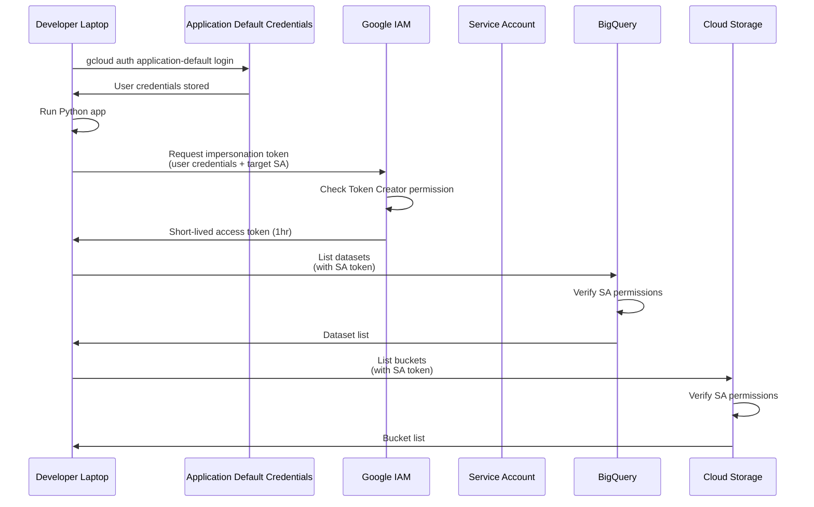
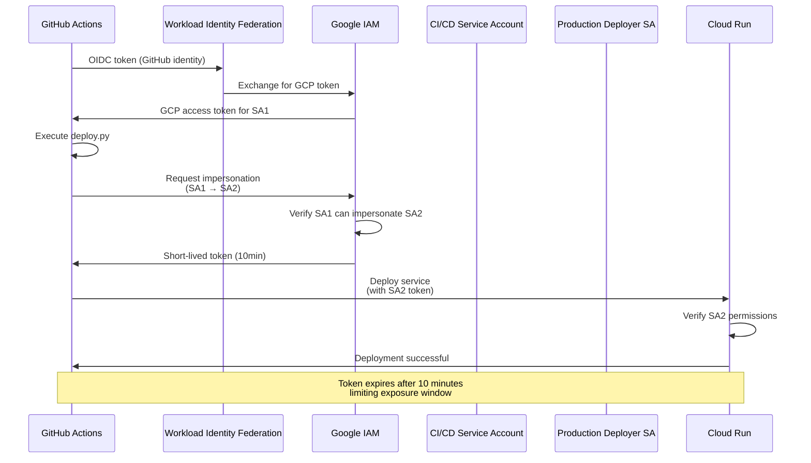
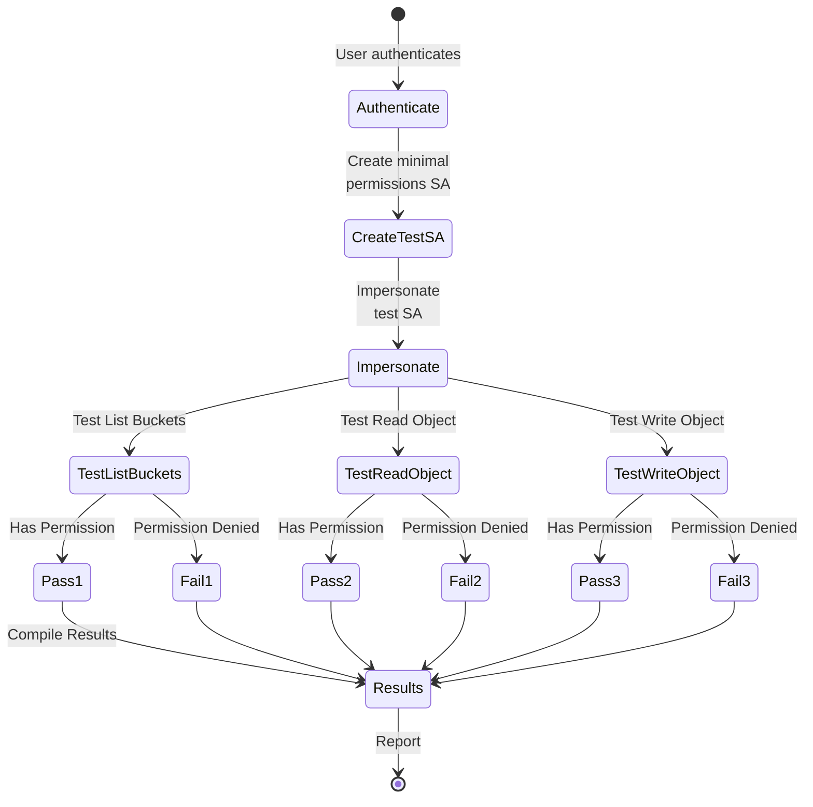
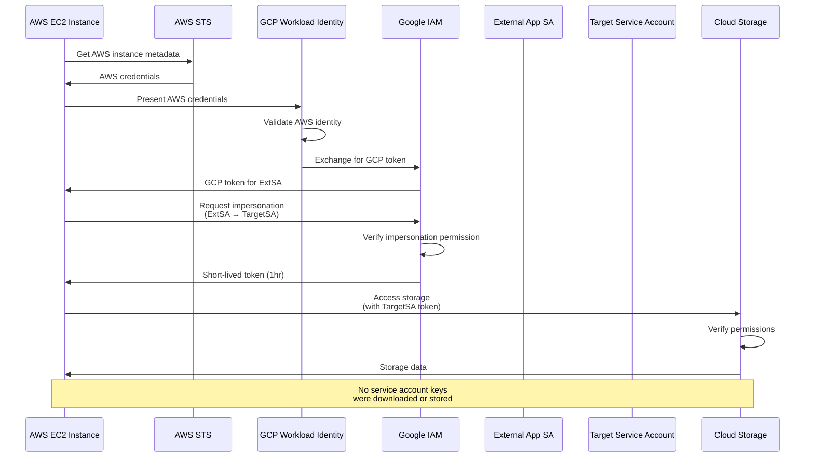
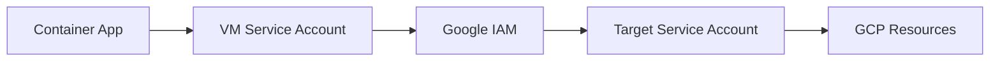

# GCP Service Account Impersonation Demo

## Overview

Service account impersonation allows authenticated principals (users or service accounts) to temporarily assume the permissions of another service account without needing service account keys. This is crucial for secure development and operations.

## Common Real-World Use Cases

### 1. Local Development Without Service Account Keys

**Scenario**: A developer needs to run a Python application locally that accesses BigQuery and Cloud Storage, without downloading service account keys.



```python
# app.py - Python application using impersonation
from google.auth import impersonated_credentials
from google.auth import default
from google.cloud import bigquery
from google.cloud import storage

# Get your default credentials (your user account)
source_credentials, project = default()

# Define the service account to impersonate
target_service_account = 'data-processor@your-project.iam.gserviceaccount.com'
target_scopes = [
    'https://www.googleapis.com/auth/bigquery',
    'https://www.googleapis.com/auth/devstorage.read_write'
]

# Create impersonated credentials
impersonated_creds = impersonated_credentials.Credentials(
    source_credentials=source_credentials,
    target_principal=target_service_account,
    target_scopes=target_scopes,
    lifetime=3600  # 1 hour
)

# Use the impersonated credentials with clients
bq_client = bigquery.Client(credentials=impersonated_creds, project=project)
storage_client = storage.Client(credentials=impersonated_creds, project=project)

# Now you can use these clients as if you were the service account
datasets = list(bq_client.list_datasets())
buckets = list(storage_client.list_buckets())
```

**Setup Steps**:
```bash
# 1. Grant yourself permission to impersonate the service account
gcloud iam service-accounts add-iam-policy-binding \
    data-processor@your-project.iam.gserviceaccount.com \
    --member="user:developer@company.com" \
    --role="roles/iam.serviceAccountTokenCreator"

# 2. Authenticate locally with your user account
gcloud auth application-default login

# 3. Run your Python application
python app.py
```

### 2. CI/CD Pipeline with Temporary Elevated Permissions

**Scenario**: GitHub Actions workflow needs to deploy to production with elevated permissions.



```python
# deploy.py - Deployment script using impersonation
import os
from google.auth import impersonated_credentials
from google.auth import default
from google.cloud import run_v2

def deploy_to_cloud_run():
    # In CI/CD, this uses Workload Identity Federation
    source_credentials, project = default()
    
    # Production deployment service account
    deploy_sa = 'prod-deployer@your-project.iam.gserviceaccount.com'
    
    impersonated_creds = impersonated_credentials.Credentials(
        source_credentials=source_credentials,
        target_principal=deploy_sa,
        target_scopes=['https://www.googleapis.com/auth/cloud-platform'],
        lifetime=600  # 10 minutes - just enough for deployment
    )
    
    # Deploy using elevated permissions
    client = run_v2.ServicesClient(credentials=impersonated_creds)
    # ... deployment logic
```

### 3. Multi-Environment Access Pattern

**Scenario**: Application needs to access resources across dev, staging, and production environments with different service accounts.

```mermaid
flowchart TB
    subgraph "Application Logic"
        App[Python Application]
        Env{Environment<br/>Detection}
    end
    
    subgraph "Service Accounts"
        DevSA[app-dev@dev-project]
        StageSA[app-staging@staging-project]
        ProdSA[app-prod@prod-project]
    end
    
    subgraph "Resources"
        DevRes[Dev Secrets<br/>Dev Storage]
        StageRes[Stage Secrets<br/>Stage Storage]
        ProdRes[Prod Secrets<br/>Prod Storage]
    end
    
    App --> Env
    Env -->|ENVIRONMENT=dev| DevSA
    Env -->|ENVIRONMENT=staging| StageSA
    Env -->|ENVIRONMENT=prod| ProdSA
    
    DevSA -->|Impersonated Access| DevRes
    StageSA -->|Impersonated Access| StageRes
    ProdSA -->|Impersonated Access| ProdRes
    
    style DevSA fill:#90EE90
    style StageSA fill:#FFD700
    style ProdSA fill:#FF6B6B
```

```python
# multi_env_access.py
from google.auth import impersonated_credentials
from google.auth import default
from google.cloud import secretmanager
import os

class MultiEnvironmentClient:
    def __init__(self):
        self.source_creds, self.project = default()
        self.env = os.getenv('ENVIRONMENT', 'dev')
        
        # Map environments to service accounts
        self.sa_mapping = {
            'dev': 'app-dev@dev-project.iam.gserviceaccount.com',
            'staging': 'app-staging@staging-project.iam.gserviceaccount.com',
            'prod': 'app-prod@prod-project.iam.gserviceaccount.com'
        }
    
    def get_client(self, service='secretmanager'):
        target_sa = self.sa_mapping[self.env]
        
        impersonated_creds = impersonated_credentials.Credentials(
            source_credentials=self.source_creds,
            target_principal=target_sa,
            target_scopes=['https://www.googleapis.com/auth/cloud-platform'],
            lifetime=3600
        )
        
        if service == 'secretmanager':
            return secretmanager.SecretManagerServiceClient(
                credentials=impersonated_creds
            )
        # Add other services as needed
    
    def get_secret(self, secret_name):
        client = self.get_client('secretmanager')
        # Access secret using impersonated credentials
        name = f"projects/{self.project}/secrets/{secret_name}/versions/latest"
        response = client.access_secret_version(request={"name": name})
        return response.payload.data.decode('utf-8')

# Usage
client = MultiEnvironmentClient()
api_key = client.get_secret('api-key')
```

### 4. Testing IAM Permissions

**Scenario**: Verify that a service account has exactly the permissions needed for a task.



```python
# test_permissions.py
from google.auth import impersonated_credentials
from google.auth import default
from google.cloud import storage
from google.api_core import exceptions

def test_minimum_permissions():
    source_creds, project = default()
    
    # Service account with minimal permissions to test
    test_sa = 'minimal-perms@your-project.iam.gserviceaccount.com'
    
    impersonated_creds = impersonated_credentials.Credentials(
        source_credentials=source_creds,
        target_principal=test_sa,
        target_scopes=['https://www.googleapis.com/auth/cloud-platform'],
        lifetime=300  # 5 minutes
    )
    
    client = storage.Client(credentials=impersonated_creds, project=project)
    
    # Test operations
    tests = {
        'list_buckets': lambda: list(client.list_buckets()),
        'read_object': lambda: client.bucket('test-bucket').blob('test.txt').download_as_text(),
        'write_object': lambda: client.bucket('test-bucket').blob('new.txt').upload_from_string('test')
    }
    
    results = {}
    for test_name, test_func in tests.items():
        try:
            test_func()
            results[test_name] = 'PASS'
        except exceptions.PermissionDenied:
            results[test_name] = 'FAIL - Permission Denied'
        except Exception as e:
            results[test_name] = f'FAIL - {str(e)}'
    
    return results
```

### 5. Using gcloud CLI with Impersonation

```bash
# List resources as a service account without downloading keys
gcloud compute instances list \
    --impersonate-service-account=compute-viewer@your-project.iam.gserviceaccount.com

# Deploy Cloud Function with deployment service account
gcloud functions deploy my-function \
    --source=. \
    --trigger-http \
    --impersonate-service-account=deployer@your-project.iam.gserviceaccount.com

# Set up Application Default Credentials with impersonation
gcloud auth application-default login \
    --impersonate-service-account=app-dev@your-project.iam.gserviceaccount.com
```

### 6. Workload Identity Federation with Impersonation

**Scenario**: External application (e.g., from AWS) needs to access GCP resources.



```python
# external_app.py - Running on AWS EC2
import json
from google.auth import external_account
from google.auth import impersonated_credentials
from google.cloud import storage

# Load the credential configuration
with open('gcp-credentials.json') as f:
    config = json.load(f)

# Create external account credentials (from AWS)
source_credentials = external_account.Credentials.from_info(config)

# Impersonate GCP service account
target_sa = 'external-app@your-project.iam.gserviceaccount.com'
impersonated_creds = impersonated_credentials.Credentials(
    source_credentials=source_credentials,
    target_principal=target_sa,
    target_scopes=['https://www.googleapis.com/auth/cloud-platform'],
    lifetime=3600
)

# Use GCP services
client = storage.Client(credentials=impersonated_creds)
```

## Best Practices

### 1. Principle of Least Privilege
```python
# Create focused service accounts for specific tasks
service_accounts = {
    'bigquery-reader': ['roles/bigquery.dataViewer'],
    'storage-writer': ['roles/storage.objectCreator'],
    'deploy-agent': ['roles/run.developer', 'roles/storage.objectViewer']
}
```

### 2. Short-Lived Credentials
```python
# Always use appropriate lifetimes
impersonated_creds = impersonated_credentials.Credentials(
    source_credentials=source_credentials,
    target_principal=target_sa,
    target_scopes=scopes,
    lifetime=900  # 15 minutes for deployment tasks
)
```

### 3. Audit Trail
```python
# Log impersonation activities
import logging

logger = logging.getLogger(__name__)

def create_impersonated_client(target_sa, service_type):
    logger.info(f"Impersonating {target_sa} for {service_type} access")
    # ... impersonation logic
    logger.info(f"Successfully created {service_type} client with impersonated credentials")
```

### 4. Environment-Specific Configuration
```python
# config.py
import os

IMPERSONATION_CONFIG = {
    'development': {
        'enabled': True,
        'default_lifetime': 3600,
        'allowed_targets': ['*-dev@*.iam.gserviceaccount.com']
    },
    'production': {
        'enabled': True,
        'default_lifetime': 900,
        'allowed_targets': ['specific-prod-sa@prod-project.iam.gserviceaccount.com']
    }
}

def get_impersonation_config():
    env = os.getenv('ENVIRONMENT', 'development')
    return IMPERSONATION_CONFIG.get(env, IMPERSONATION_CONFIG['development'])
```

## Common Errors and Solutions

### 1. Permission Denied
```python
# Error: 403 Permission 'iam.serviceAccounts.getAccessToken' denied
# Solution: Grant Service Account Token Creator role
```

### 2. Invalid Lifetime
```python
# Error: Lifetime cannot exceed 43200 seconds (12 hours)
# Solution: Use shorter lifetime
lifetime = min(desired_lifetime, 43200)
```

### 3. Quota Exceeded
```python
# Implement exponential backoff for token generation
import time
from google.api_core import retry

@retry.Retry(predicate=retry.if_exception_type(Exception))
def get_impersonated_credentials_with_retry(*args, **kwargs):
    return impersonated_credentials.Credentials(*args, **kwargs)
```

## Security Considerations

1. **Never mix impersonation with service account keys**
2. **Always validate the target service account**
3. **Use dedicated service accounts for impersonation**
4. **Monitor impersonation activities in Cloud Logging**
5. **Implement token refresh logic for long-running processes**

## Conclusion

Service account impersonation provides a secure, auditable way to access GCP resources without managing service account keys. It's particularly valuable for local development, CI/CD pipelines, and cross-environment access patterns.

## Frequently Asked Questions (FAQ)

### Local Development & Testing

**Q: How do I switch between different service accounts during development?**

A: You have several options for switching between service accounts:

```python
# Option 1: Environment variable approach
import os
from google.auth import impersonated_credentials, default

def get_client(service_type='storage'):
    source_creds, project = default()
    
    # Switch based on environment variable
    sa_mapping = {
        'dev': 'dev-sa@project.iam.gserviceaccount.com',
        'test': 'test-sa@project.iam.gserviceaccount.com',
        'prod': 'prod-sa@project.iam.gserviceaccount.com'
    }
    
    env = os.getenv('APP_ENV', 'dev')
    target_sa = sa_mapping.get(env)
    
    impersonated_creds = impersonated_credentials.Credentials(
        source_credentials=source_creds,
        target_principal=target_sa,
        target_scopes=['https://www.googleapis.com/auth/cloud-platform'],
        lifetime=3600
    )
    
    if service_type == 'storage':
        from google.cloud import storage
        return storage.Client(credentials=impersonated_creds)
```

```bash
# Option 2: Use gcloud config configurations
gcloud config configurations create dev-env
gcloud config set account dev@company.com
gcloud auth application-default login

# Switch between configurations
gcloud config configurations activate prod-env
```

---

**Q: My local app works but fails when deployed to a VM/container. Why?**

A: This is usually because the VM's service account doesn't have permission to impersonate the target service account. Check:

1. **Verify VM service account permissions:**
```bash
# Get the VM's service account
gcloud compute instances describe VM_NAME --format='value(serviceAccounts[0].email)'

# Grant impersonation permission
gcloud iam service-accounts add-iam-policy-binding TARGET_SA@PROJECT.iam.gserviceaccount.com \
    --member="serviceAccount:VM_SA@PROJECT.iam.gserviceaccount.com" \
    --role="roles/iam.serviceAccountTokenCreator"
```

2. **Debug authentication chain:**
```python
import google.auth

# Add debugging to see what credentials are being used
source_creds, project = default()
print(f"Source credentials type: {type(source_creds)}")
print(f"Project: {project}")

# For service account credentials, you can see the email
if hasattr(source_creds, 'service_account_email'):
    print(f"Service account: {source_creds.service_account_email}")
```

---

**Q: How can I test if my service account has the right permissions before deploying?**

A: Create a permission testing script:

```python
# test_permissions.py
from google.auth import impersonated_credentials, default
from google.cloud import storage, bigquery
from google.api_core import exceptions
import sys

def test_sa_permissions(target_sa, tests_to_run):
    source_creds, project = default()
    
    try:
        impersonated_creds = impersonated_credentials.Credentials(
            source_credentials=source_creds,
            target_principal=target_sa,
            target_scopes=['https://www.googleapis.com/auth/cloud-platform'],
            lifetime=300
        )
    except Exception as e:
        print(f"❌ Cannot impersonate {target_sa}: {e}")
        return False
    
    results = {}
    
    # Test storage permissions
    if 'storage' in tests_to_run:
        storage_client = storage.Client(credentials=impersonated_creds)
        try:
            list(storage_client.list_buckets(max_results=1))
            results['storage.list_buckets'] = '✅ PASS'
        except exceptions.PermissionDenied:
            results['storage.list_buckets'] = '❌ FAIL - Permission Denied'
        except Exception as e:
            results['storage.list_buckets'] = f'❌ FAIL - {e}'
    
    # Test BigQuery permissions  
    if 'bigquery' in tests_to_run:
        bq_client = bigquery.Client(credentials=impersonated_creds)
        try:
            list(bq_client.list_datasets(max_results=1))
            results['bigquery.list_datasets'] = '✅ PASS'
        except exceptions.PermissionDenied:
            results['bigquery.list_datasets'] = '❌ FAIL - Permission Denied'
        except Exception as e:
            results['bigquery.list_datasets'] = f'❌ FAIL - {e}'
    
    return results

# Usage
if __name__ == "__main__":
    sa = sys.argv[1] if len(sys.argv) > 1 else 'my-sa@project.iam.gserviceaccount.com'
    results = test_sa_permissions(sa, ['storage', 'bigquery'])
    for test, result in results.items():
        print(f"{test}: {result}")
```

### Container & VM Deployment

**Q: How does impersonation work when my app runs in a container on a GCP VM?**

A: The authentication chain works as follows:



The container inherits the VM's service account through the metadata server. No code changes needed:

```python
# This code works the same locally and in a container on a VM
from google.auth import impersonated_credentials, default

source_creds, project = default()  # Gets VM SA in container
impersonated_creds = impersonated_credentials.Credentials(
    source_credentials=source_creds,
    target_principal='target-sa@project.iam.gserviceaccount.com',
    target_scopes=['https://www.googleapis.com/auth/cloud-platform']
)
```

**Dockerfile example:**
```dockerfile
FROM python:3.9-slim

WORKDIR /app

COPY requirements.txt .
RUN pip install -r requirements.txt

COPY . .

# No credentials needed in the image!
CMD ["python", "app.py"]
```

---

**Q: Do I need to change my code when moving from local to VM deployment?**

A: No! That's the beauty of using `google.auth.default()`. However, you might want to add environment-aware configuration:

```python
import os
from google.auth import impersonated_credentials, default

class EnvironmentAwareAuth:
    def __init__(self):
        self.is_local = not os.getenv('K_SERVICE') and not os.path.exists('/var/run/secrets/kubernetes.io')
        self.source_creds, self.project = default()
        
    def get_credentials(self, target_sa=None):
        # Use direct credentials for local development if specified
        if self.is_local and os.getenv('USE_DEFAULT_CREDENTIALS'):
            return self.source_creds
        
        # Otherwise use impersonation
        target = target_sa or os.getenv('TARGET_SERVICE_ACCOUNT')
        if not target:
            raise ValueError("No target service account specified")
            
        return impersonated_credentials.Credentials(
            source_credentials=self.source_creds,
            target_principal=target,
            target_scopes=['https://www.googleapis.com/auth/cloud-platform'],
            lifetime=3600
        )
```

---

**Q: What's the difference between using the VM's service account directly vs impersonation?**

A: Here are the key differences:

| Aspect | Direct VM SA | With Impersonation |
|--------|--------------|-------------------|
| **Permissions** | VM SA needs all permissions | VM SA only needs Token Creator role |
| **Audit Logs** | Shows VM SA as actor | Shows both VM SA and target SA |
| **Security** | Higher risk if VM compromised | Limited blast radius |
| **Flexibility** | One set of permissions | Can impersonate different SAs |
| **Code Changes** | None | Minimal (add impersonation) |

```python
# Direct approach (less secure)
from google.cloud import storage
client = storage.Client()  # Uses VM's SA directly

# Impersonation approach (recommended)
from google.auth import impersonated_credentials, default
source_creds, _ = default()
target_creds = impersonated_credentials.Credentials(
    source_credentials=source_creds,
    target_principal='minimal-perms@project.iam.gserviceaccount.com',
    target_scopes=['https://www.googleapis.com/auth/cloud-platform']
)
client = storage.Client(credentials=target_creds)
```

### CI/CD & Automation

**Q: How do I use impersonation in GitHub Actions?**

A: Use Workload Identity Federation + impersonation:

```yaml
# .github/workflows/deploy.yml
name: Deploy with Impersonation

on:
  push:
    branches: [main]

jobs:
  deploy:
    runs-on: ubuntu-latest
    permissions:
      contents: read
      id-token: write  # Required for WIF

    steps:
    - uses: actions/checkout@v3
    
    - id: auth
      uses: google-github-actions/auth@v1
      with:
        workload_identity_provider: 'projects/PROJECT_NUMBER/locations/global/workloadIdentityPools/github-pool/providers/github-provider'
        service_account: 'github-actions@project.iam.gserviceaccount.com'
    
    - name: Deploy with impersonation
      run: |
        # The GitHub Actions SA will impersonate the deployer SA
        gcloud run deploy my-app \
          --source . \
          --impersonate-service-account=deployer@project.iam.gserviceaccount.com
```

---

**Q: Can I impersonate multiple service accounts in a single pipeline?**

A: Yes! You can impersonate different SAs for different tasks:

```python
# deploy_pipeline.py
from google.auth import impersonated_credentials, default

class MultiServiceAccountPipeline:
    def __init__(self):
        self.source_creds, self.project = default()
        
    def get_impersonated_creds(self, target_sa, scopes=None):
        return impersonated_credentials.Credentials(
            source_credentials=self.source_creds,
            target_principal=target_sa,
            target_scopes=scopes or ['https://www.googleapis.com/auth/cloud-platform'],
            lifetime=600  # 10 minutes for CI/CD tasks
        )
    
    def build_images(self):
        # Use build SA with only Cloud Build permissions
        build_creds = self.get_impersonated_creds('builder@project.iam.gserviceaccount.com')
        # ... build logic
        
    def run_tests(self):
        # Use test SA with access to test resources
        test_creds = self.get_impersonated_creds('tester@project.iam.gserviceaccount.com')
        # ... test logic
        
    def deploy(self):
        # Use deploy SA with production access
        deploy_creds = self.get_impersonated_creds('deployer@project.iam.gserviceaccount.com')
        # ... deploy logic
```

---

**Q: How do I handle impersonation in multi-project deployments?**

A: Use cross-project impersonation:

```python
# multi_project_deploy.py
import os
from google.auth import impersonated_credentials, default

class MultiProjectDeployer:
    def __init__(self):
        self.source_creds, _ = default()
        self.project_sas = {
            'dev': 'deployer@dev-project.iam.gserviceaccount.com',
            'staging': 'deployer@staging-project.iam.gserviceaccount.com',
            'prod': 'deployer@prod-project.iam.gserviceaccount.com'
        }
    
    def deploy_to_project(self, env):
        target_sa = self.project_sas.get(env)
        if not target_sa:
            raise ValueError(f"Unknown environment: {env}")
        
        # Each project's deployer SA has permissions only in its project
        creds = impersonated_credentials.Credentials(
            source_credentials=self.source_creds,
            target_principal=target_sa,
            target_scopes=['https://www.googleapis.com/auth/cloud-platform'],
            lifetime=900
        )
        
        # Deploy to specific project
        project_id = target_sa.split('@')[1].split('.')[0]
        # ... deployment logic using creds and project_id
```

Setup for cross-project impersonation:
```bash
# Grant CI/CD SA permission to impersonate each project's deployer
for env in dev staging prod; do
  gcloud iam service-accounts add-iam-policy-binding \
    deployer@${env}-project.iam.gserviceaccount.com \
    --member="serviceAccount:ci-cd@tools-project.iam.gserviceaccount.com" \
    --role="roles/iam.serviceAccountTokenCreator" \
    --project=${env}-project
done
```

### Security & Best Practices

**Q: When should I use impersonation vs service account keys?**

A: **Always prefer impersonation.** Here's why:

| Scenario | Recommendation | Reason |
|----------|----------------|---------|
| Local development | Impersonation | No keys to leak, automatic expiry |
| CI/CD pipelines | WIF + Impersonation | Keyless, auditable |
| VM/Container apps | Impersonation | No keys in images |
| External systems | WIF + Impersonation | More secure than keys |
| Legacy systems | Keys (last resort) | Only if impersonation not supported |

```python
# ❌ AVOID: Using service account keys
from google.oauth2 import service_account

credentials = service_account.Credentials.from_service_account_file(
    'path/to/key.json'  # Security risk!
)

# ✅ PREFER: Using impersonation
from google.auth import impersonated_credentials, default

source_creds, _ = default()
credentials = impersonated_credentials.Credentials(
    source_credentials=source_creds,
    target_principal='my-sa@project.iam.gserviceaccount.com',
    target_scopes=['https://www.googleapis.com/auth/cloud-platform']
)
```

---

**Q: How long should I set the token lifetime?**

A: Use the shortest lifetime that works for your use case:

```python
# Recommendations by use case
LIFETIME_RECOMMENDATIONS = {
    'ci_cd_deployment': 600,      # 10 minutes
    'batch_processing': 3600,      # 1 hour  
    'local_development': 3600,     # 1 hour
    'long_running_job': 12 * 3600, # 12 hours (max)
    'api_request': 300,            # 5 minutes
}

def get_credentials_with_appropriate_lifetime(use_case):
    lifetime = LIFETIME_RECOMMENDATIONS.get(use_case, 3600)
    
    source_creds, _ = default()
    return impersonated_credentials.Credentials(
        source_credentials=source_creds,
        target_principal='my-sa@project.iam.gserviceaccount.com',
        target_scopes=['https://www.googleapis.com/auth/cloud-platform'],
        lifetime=lifetime
    )
```

---

**Q: Can I audit who is impersonating my service accounts?**

A: Yes! Use Cloud Logging to monitor impersonation:

```python
# Query to find impersonation events
from google.cloud import logging

def get_impersonation_audit_logs(service_account):
    client = logging.Client()
    
    # Filter for impersonation events
    filter_str = f'''
    protoPayload.methodName="GenerateAccessToken"
    AND protoPayload.request.name=~"serviceAccounts/{service_account}"
    '''
    
    for entry in client.list_entries(filter_=filter_str):
        print(f"Time: {entry.timestamp}")
        print(f"Caller: {entry.payload.get('authenticationInfo', {}).get('principalEmail')}")
        print(f"Target SA: {service_account}")
        print("---")
```

You can also set up alerts:
```bash
# Create alert for unusual impersonation activity
gcloud logging metrics create suspicious_impersonation \
    --description="Unusual service account impersonation" \
    --log-filter='
    protoPayload.methodName="GenerateAccessToken"
    AND protoPayload.authenticationInfo.principalEmail!~"expected-user@company.com"'
```

---

**Q: What happens if someone gains access to my impersonation permissions?**

A: The blast radius is limited compared to service account keys:

1. **Time-limited**: Tokens expire (max 12 hours)
2. **Auditable**: All impersonation is logged
3. **Revocable**: Remove IAM binding to stop access immediately
4. **Scoped**: Only specified scopes are available

Emergency response:
```bash
# Immediately revoke impersonation access
gcloud iam service-accounts remove-iam-policy-binding \
    target-sa@project.iam.gserviceaccount.com \
    --member="user:compromised@company.com" \
    --role="roles/iam.serviceAccountTokenCreator"

# Check recent usage
gcloud logging read '
protoPayload.methodName="GenerateAccessToken" 
AND protoPayload.authenticationInfo.principalEmail="compromised@company.com"' \
    --limit=50 \
    --format=json
```

### Troubleshooting

**Q: I'm getting "Permission denied" when trying to impersonate. What should I check?**

A: Follow this troubleshooting checklist:

```bash
# 1. Check your current identity
gcloud auth list
gcloud config get-value account

# 2. Verify you have Token Creator role
gcloud iam service-accounts get-iam-policy TARGET_SA@PROJECT.iam.gserviceaccount.com

# 3. Test impersonation directly
gcloud auth print-access-token \
    --impersonate-service-account=TARGET_SA@PROJECT.iam.gserviceaccount.com

# 4. Check if the target SA exists and is enabled
gcloud iam service-accounts describe TARGET_SA@PROJECT.iam.gserviceaccount.com
```

Common issues:
```python
# Debugging script
from google.auth import impersonated_credentials, default
import google.auth.exceptions

def debug_impersonation(target_sa):
    try:
        source_creds, project = default()
        print(f"✅ Source credentials obtained")
        print(f"   Type: {type(source_creds).__name__}")
        
        if hasattr(source_creds, 'service_account_email'):
            print(f"   Identity: {source_creds.service_account_email}")
        
        # Try impersonation
        imp_creds = impersonated_credentials.Credentials(
            source_credentials=source_creds,
            target_principal=target_sa,
            target_scopes=['https://www.googleapis.com/auth/cloud-platform'],
            lifetime=300
        )
        
        # Force token refresh to test
        imp_creds.refresh(google.auth.transport.requests.Request())
        print(f"✅ Successfully impersonated {target_sa}")
        
    except google.auth.exceptions.RefreshError as e:
        print(f"❌ Permission denied: {e}")
        print("   Check: Does your identity have roles/iam.serviceAccountTokenCreator?")
    except Exception as e:
        print(f"❌ Error: {type(e).__name__}: {e}")
```

---

**Q: My impersonated credentials work for some APIs but not others. Why?**

A: This is usually a scope issue. Different APIs require different scopes:

```python
# API-specific scopes
API_SCOPES = {
    'storage': ['https://www.googleapis.com/auth/devstorage.full_control'],
    'bigquery': ['https://www.googleapis.com/auth/bigquery'],
    'compute': ['https://www.googleapis.com/auth/compute'],
    'cloud-platform': ['https://www.googleapis.com/auth/cloud-platform'],  # Works for most
}

def get_api_specific_credentials(target_sa, api):
    source_creds, _ = default()
    
    # Use specific scopes for the API
    scopes = API_SCOPES.get(api, API_SCOPES['cloud-platform'])
    
    return impersonated_credentials.Credentials(
        source_credentials=source_creds,
        target_principal=target_sa,
        target_scopes=scopes,
        lifetime=3600
    )

# Usage
storage_creds = get_api_specific_credentials('my-sa@project.iam.gserviceaccount.com', 'storage')
bq_creds = get_api_specific_credentials('my-sa@project.iam.gserviceaccount.com', 'bigquery')
```

---

**Q: How do I debug authentication issues in production?**

A: Add comprehensive logging without exposing sensitive data:

```python
import logging
import os
from google.auth import impersonated_credentials, default
import google.auth.transport.requests

# Configure structured logging
if os.getenv('K_SERVICE'):  # Running on Cloud Run
    import google.cloud.logging
    client = google.cloud.logging.Client()
    client.setup_logging()

logger = logging.getLogger(__name__)

class AuthDebugger:
    def __init__(self):
        self.source_creds = None
        self.target_sa = os.getenv('TARGET_SERVICE_ACCOUNT')
        
    def get_credentials(self):
        try:
            # Log authentication flow
            logger.info("Starting authentication flow")
            
            self.source_creds, project = default()
            logger.info(f"Source credential type: {type(self.source_creds).__name__}")
            
            # Log identity (safely)
            if hasattr(self.source_creds, 'service_account_email'):
                sa_email = self.source_creds.service_account_email
                logger.info(f"Source identity: ...@{sa_email.split('@')[1]}")
            
            if not self.target_sa:
                logger.error("No TARGET_SERVICE_ACCOUNT environment variable set")
                raise ValueError("Missing target service account")
            
            logger.info(f"Target SA domain: ...@{self.target_sa.split('@')[1]}")
            
            # Create impersonated credentials
            imp_creds = impersonated_credentials.Credentials(
                source_credentials=self.source_creds,
                target_principal=self.target_sa,
                target_scopes=['https://www.googleapis.com/auth/cloud-platform'],
                lifetime=3600
            )
            
            # Test the credentials
            request = google.auth.transport.requests.Request()
            imp_creds.refresh(request)
            logger.info("Successfully obtained impersonated credentials")
            
            return imp_creds
            
        except Exception as e:
            logger.error(f"Authentication failed: {type(e).__name__}: {str(e)}")
            # Log additional context for debugging
            logger.error(f"Environment: {os.getenv('ENV', 'unknown')}")
            logger.error(f"Running on GCP: {os.path.exists('/var/run/secrets/kubernetes.io')}")
            raise
```

---

**Q: The token expired in the middle of my long-running process. How do I handle this?**

A: Implement automatic token refresh:

```python
from google.auth import impersonated_credentials, default
import google.auth.transport.requests
from datetime import datetime, timedelta
import threading

class RefreshableImpersonatedCredentials:
    def __init__(self, target_sa, lifetime=3600):
        self.target_sa = target_sa
        self.lifetime = lifetime
        self.source_creds, _ = default()
        self._lock = threading.Lock()
        self._credentials = None
        self._expiry = None
        
    def get_credentials(self):
        with self._lock:
            # Check if we need to refresh
            if self._credentials is None or self._needs_refresh():
                self._refresh_credentials()
            return self._credentials
    
    def _needs_refresh(self):
        if self._expiry is None:
            return True
        # Refresh 5 minutes before expiry
        return datetime.utcnow() > (self._expiry - timedelta(minutes=5))
    
    def _refresh_credentials(self):
        self._credentials = impersonated_credentials.Credentials(
            source_credentials=self.source_creds,
            target_principal=self.target_sa,
            target_scopes=['https://www.googleapis.com/auth/cloud-platform'],
            lifetime=self.lifetime
        )
        # Force refresh to get actual expiry
        request = google.auth.transport.requests.Request()
        self._credentials.refresh(request)
        self._expiry = self._credentials.expiry

# Usage in long-running process
cred_manager = RefreshableImpersonatedCredentials('my-sa@project.iam.gserviceaccount.com')

def process_large_dataset():
    for chunk in large_dataset:
        # Get fresh credentials for each chunk
        creds = cred_manager.get_credentials()
        client = storage.Client(credentials=creds)
        # Process chunk...
```

### Performance & Scalability

**Q: Is there a performance overhead with impersonation?**

A: Yes, but it's minimal and worth the security benefits:

```python
import time
from google.auth import impersonated_credentials, default

# Benchmark impersonation overhead
def benchmark_impersonation():
    source_creds, _ = default()
    
    # Time direct credential usage
    start = time.time()
    # Direct use of source credentials
    direct_time = time.time() - start
    
    # Time impersonation
    start = time.time()
    imp_creds = impersonated_credentials.Credentials(
        source_credentials=source_creds,
        target_principal='my-sa@project.iam.gserviceaccount.com',
        target_scopes=['https://www.googleapis.com/auth/cloud-platform'],
        lifetime=3600
    )
    imp_creds.refresh(google.auth.transport.requests.Request())
    impersonation_time = time.time() - start
    
    print(f"Impersonation overhead: {impersonation_time - direct_time:.3f} seconds")
    # Typically < 100ms
```

Optimization strategies:
```python
# Cache credentials for the lifetime
class CredentialCache:
    def __init__(self):
        self._cache = {}
        
    def get_impersonated_credentials(self, target_sa, lifetime=3600):
        cache_key = f"{target_sa}:{lifetime}"
        
        if cache_key in self._cache:
            creds = self._cache[cache_key]
            # Check if still valid
            if creds.expiry and creds.expiry > datetime.utcnow():
                return creds
        
        # Create new credentials
        source_creds, _ = default()
        creds = impersonated_credentials.Credentials(
            source_credentials=source_creds,
            target_principal=target_sa,
            target_scopes=['https://www.googleapis.com/auth/cloud-platform'],
            lifetime=lifetime
        )
        self._cache[cache_key] = creds
        return creds
```

---

**Q: Are there rate limits on impersonation requests?**

A: Yes, there are quotas:

- **Token generation**: ~1000 requests per minute per service account
- **Concurrent tokens**: No hard limit, but tokens consume quota

Handle rate limits gracefully:
```python
from google.auth import impersonated_credentials, default
from google.api_core import retry
import time

class RateLimitedImpersonation:
    def __init__(self, target_sa):
        self.target_sa = target_sa
        self.source_creds, _ = default()
        
    @retry.Retry(
        predicate=retry.if_exception_type(Exception),
        initial=1.0,
        maximum=60.0,
        multiplier=2.0
    )
    def get_credentials(self):
        try:
            return impersonated_credentials.Credentials(
                source_credentials=self.source_creds,
                target_principal=self.target_sa,
                target_scopes=['https://www.googleapis.com/auth/cloud-platform'],
                lifetime=3600
            )
        except Exception as e:
            if "Quota exceeded" in str(e):
                # Log quota issue
                logger.warning(f"Impersonation quota exceeded for {self.target_sa}")
            raise
```

---

**Q: Should I cache impersonated credentials?**

A: Yes, but carefully:

```python
from functools import lru_cache
from datetime import datetime, timedelta

class SmartCredentialProvider:
    def __init__(self):
        self.source_creds, _ = default()
    
    @lru_cache(maxsize=128)
    def get_cached_credentials(self, target_sa, lifetime):
        """Cache based on SA and lifetime"""
        return self._create_credentials(target_sa, lifetime)
    
    def get_credentials(self, target_sa, lifetime=3600):
        # Get cached credentials
        creds = self.get_cached_credentials(target_sa, lifetime)
        
        # Check if expired or about to expire
        if hasattr(creds, 'expiry') and creds.expiry:
            time_to_expiry = creds.expiry - datetime.utcnow()
            if time_to_expiry < timedelta(minutes=5):
                # Clear cache and get new credentials
                self.get_cached_credentials.cache_clear()
                creds = self.get_cached_credentials(target_sa, lifetime)
        
        return creds
    
    def _create_credentials(self, target_sa, lifetime):
        return impersonated_credentials.Credentials(
            source_credentials=self.source_creds,
            target_principal=target_sa,
            target_scopes=['https://www.googleapis.com/auth/cloud-platform'],
            lifetime=lifetime
        )
```

### Cross-Cloud & Hybrid Scenarios

**Q: Can I use impersonation from AWS/Azure to access GCP?**

A: Yes, using Workload Identity Federation + impersonation:

```python
# From AWS Lambda to GCP
import json
import requests
from google.auth import external_account
from google.auth import impersonated_credentials

def lambda_handler(event, context):
    # Get AWS credentials from Lambda environment
    aws_session = boto3.Session()
    credentials = aws_session.get_credentials()
    
    # Configure external account credentials
    external_account_config = {
        "type": "external_account",
        "audience": f"//iam.googleapis.com/projects/{PROJECT_NUMBER}/locations/global/workloadIdentityPools/{POOL_ID}/providers/{PROVIDER_ID}",
        "subject_token_type": "urn:ietf:params:aws:token-type:aws4_request",
        "service_account_impersonation_url": f"https://iamcredentials.googleapis.com/v1/projects/-/serviceAccounts/{WIF_SA}@{PROJECT}.iam.gserviceaccount.com:generateAccessToken",
        "credential_source": {
            "environment_id": "aws1",
            "regional_cred_verification_url": "https://sts.{region}.amazonaws.com?Action=GetCallerIdentity&Version=2011-06-15"
        }
    }
    
    # Create external account credentials
    source_creds = external_account.Credentials.from_info(external_account_config)
    
    # Impersonate target GCP service account
    target_creds = impersonated_credentials.Credentials(
        source_credentials=source_creds,
        target_principal='data-processor@gcp-project.iam.gserviceaccount.com',
        target_scopes=['https://www.googleapis.com/auth/cloud-platform'],
        lifetime=3600
    )
    
    # Use credentials to access GCP
    from google.cloud import storage
    client = storage.Client(credentials=target_creds)
    # ... do work
```

---

**Q: How do I impersonate from on-premises systems?**

A: Use Workload Identity Federation with OIDC:

```python
# on_premises_impersonation.py
import json
from google.auth import external_account
from google.auth import impersonated_credentials

class OnPremisesAuth:
    def __init__(self, oidc_token_endpoint, client_id, client_secret):
        self.token_endpoint = oidc_token_endpoint
        self.client_id = client_id
        self.client_secret = client_secret
        
    def get_gcp_credentials(self, target_sa):
        # Get OIDC token from your identity provider
        oidc_token = self._get_oidc_token()
        
        # Configure external account
        config = {
            "type": "external_account",
            "audience": f"//iam.googleapis.com/projects/{PROJECT_NUMBER}/locations/global/workloadIdentityPools/{POOL_ID}/providers/{PROVIDER_ID}",
            "subject_token_type": "urn:ietf:params:oauth:token-type:jwt",
            "token_url": "https://sts.googleapis.com/v1/token",
            "credential_source": {
                "text": oidc_token
            }
        }
        
        # Create external credentials
        source_creds = external_account.Credentials.from_info(config)
        
        # Impersonate
        return impersonated_credentials.Credentials(
            source_credentials=source_creds,
            target_principal=target_sa,
            target_scopes=['https://www.googleapis.com/auth/cloud-platform'],
            lifetime=3600
        )
    
    def _get_oidc_token(self):
        # Get token from your identity provider
        response = requests.post(
            self.token_endpoint,
            data={
                'grant_type': 'client_credentials',
                'client_id': self.client_id,
                'client_secret': self.client_secret,
                'scope': 'openid'
            }
        )
        return response.json()['id_token']
```

---

**Q: What about impersonation in Kubernetes/GKE?**

A: Use Workload Identity for GKE + impersonation:

```yaml
# kubernetes/deployment.yaml
apiVersion: apps/v1
kind: Deployment
metadata:
  name: my-app
spec:
  template:
    spec:
      serviceAccountName: my-ksa  # Kubernetes SA
      containers:
      - name: app
        image: gcr.io/my-project/my-app
        env:
        - name: TARGET_SERVICE_ACCOUNT
          value: "data-processor@my-project.iam.gserviceaccount.com"
```

```python
# app.py - Running in GKE
from google.auth import impersonated_credentials, default

def get_gke_impersonated_credentials():
    # Gets credentials from GKE Workload Identity
    source_creds, project = default()
    
    # The source will be the GSA bound to your KSA
    print(f"Running as: {source_creds.service_account_email}")
    
    # Impersonate target SA
    target_sa = os.getenv('TARGET_SERVICE_ACCOUNT')
    return impersonated_credentials.Credentials(
        source_credentials=source_creds,
        target_principal=target_sa,
        target_scopes=['https://www.googleapis.com/auth/cloud-platform'],
        lifetime=3600
    )
```

Setup Workload Identity binding:
```bash
# Bind Kubernetes SA to Google SA
kubectl annotate serviceaccount my-ksa \
    iam.gke.io/gcp-service-account=gke-workload@my-project.iam.gserviceaccount.com

# Allow the Google SA to impersonate target SA
gcloud iam service-accounts add-iam-policy-binding \
    data-processor@my-project.iam.gserviceaccount.com \
    --member="serviceAccount:gke-workload@my-project.iam.gserviceaccount.com" \
    --role="roles/iam.serviceAccountTokenCreator"
```

## Summary

Service account impersonation is a powerful pattern that improves security across all deployment scenarios. Key takeaways:

1. **Always prefer impersonation over service account keys**
2. **Use the shortest token lifetime that works for your use case**
3. **Monitor and audit all impersonation activities**
4. **The same code works locally and in production**
5. **Implement proper error handling and token refresh for production**

Remember: The small overhead of impersonation is worth the significant security benefits!