# GitFlow Process for MLOps Terraform Infrastructure

This document describes the GitFlow process and how GitHub Actions automate Terraform deployments across environments.

## GitFlow Diagram

```mermaid
graph TD
    A[Developer creates dev/feature branch] --> B[Local development & testing]
    B --> C[Push to dev/feature branch]
    C --> D{GitHub Actions}
    D -->|Auto Deploy| E[DEV Environment]
    
    C --> F[Open PR: dev/* → develop]
    F --> G{GitHub Actions}
    G -->|Plan Only| H[Stage Plan in PR Comment]
    H --> I{Reviewer Approves?}
    I -->|Yes| J[Merge PR]
    I -->|No| B
    J --> K{GitHub Actions}
    K -->|Auto Deploy| L[STAGE Environment]
    
    L --> M[DevOps Engineer 1: PR develop → main]
    M --> N{GitHub Actions}
    N -->|Plan Only| O[Prod Plan in PR Comment]
    O --> P{DevOps Engineer 2 Approves?}
    P -->|Yes| Q[Merge PR]
    P -->|No| R[Request Changes]
    Q --> S{GitHub Actions}
    S -->|Auto Deploy| T[PROD Environment]
    
    U[Daily Schedule 1 AM UTC] --> V{GitHub Actions}
    V -->|Auto Deploy| T
    
    style E fill:#90EE90
    style L fill:#FFD700
    style T fill:#FF6B6B
    style H fill:#E6E6FA
    style O fill:#E6E6FA
```



## Detailed Flow

### 1. Developer Workflow (DEV Environment)

1. **Create Feature Branch**
   ```bash
   git checkout -b dev/add-new-resource
   ```

2. **Local Development**
   - Edit Terraform files
   - Run `terraform plan` locally
   - Run `terraform apply` locally for testing

3. **Push to Remote**
   ```bash
   git push origin dev/add-new-resource
   ```
   - ✅ **Triggers**: Auto-deployment to DEV environment
   - 🎯 **Purpose**: Validate changes work in cloud environment

### 2. Stage Deployment Process

1. **Open Pull Request**
   - From: `dev/add-new-resource`
   - To: `develop`
   - ✅ **Triggers**: Plan generation for STAGE environment
   - 📋 **PR Comment**: Shows exact changes that will be applied to stage

2. **Review Process**
   - Reviewer examines the Terraform plan
   - Checks for:
     - Resource changes
     - Security implications
     - Cost impact
     - Naming conventions

3. **Merge PR**
   - ✅ **Triggers**: Auto-deployment to STAGE environment
   - 🎯 **Purpose**: Test changes in production-like environment

### 3. Production Deployment Process

1. **Open Pull Request**
   - From: `develop`
   - To: `main`
   - Opened by: DevOps Engineer 1
   - ✅ **Triggers**: Plan generation for PROD environment
   - 📋 **PR Comment**: Shows exact changes that will be applied to production

2. **Review Process**
   - Reviewed by: DevOps Engineer 2 (different person)
   - Checks for:
     - All stage testing completed
     - Change window compliance
     - Rollback plan availability
     - Business approval (if needed)

3. **Merge PR**
   - ✅ **Triggers**: Auto-deployment to PROD environment
   - 🎯 **Purpose**: Apply changes to production

## GitHub Actions Behavior

### Trigger Matrix

| Event | Condition | Environment | Action |
|-------|-----------|-------------|--------|
| `push` | Branch: `dev/*` | DEV | Plan & Apply |
| `pull_request` | Target: `develop` | STAGE | Plan Only (Comment) |
| `pull_request` | Merged → `develop` | STAGE | Plan & Apply |
| `pull_request` | Target: `main` | PROD | Plan Only (Comment) |
| `pull_request` | Merged → `main` | PROD | Plan & Apply |
| `schedule` | Daily 1 AM UTC | PROD | Plan & Apply |
| `workflow_dispatch` | Manual | DEV | Plan & Apply |

### Key Features

1. **Environment Isolation**
   - Each environment has separate state files
   - Service accounts are environment-specific
   - No cross-environment access

2. **Plan Visibility**
   - PRs show plans for **target** environment
   - Reviewers see exact changes before merge
   - No surprises after deployment

3. **Safety Mechanisms**
   - No direct push to `main` or `develop`
   - Two-person rule for production
   - Automated drift detection (daily)

## Example Scenarios

### Scenario 1: Adding a New BigQuery Dataset

1. Developer creates `dev/add-analytics-dataset`
2. Pushes branch → DEV auto-deploys
3. Opens PR to `develop` → Shows STAGE plan
4. Team lead reviews, approves → STAGE auto-deploys
5. DevOps opens PR to `main` → Shows PROD plan
6. Another DevOps engineer approves → PROD auto-deploys

### Scenario 2: Emergency Hotfix

1. Create `dev/hotfix-permissions`
2. Test in DEV (auto-deploy on push)
3. Fast-track PR to `develop` with urgent label
4. Quick review and merge → STAGE deploys
5. Immediate PR to `main` with emergency approval
6. Deploy to PROD after second approval

## Best Practices

1. **Branch Naming**
   - Use descriptive names: `dev/add-logging`, `dev/fix-iam-binding`
   - Include ticket number if applicable: `dev/JIRA-123-update-vpc`

2. **PR Descriptions**
   - Explain the "why" not just the "what"
   - Link to relevant documentation
   - Include rollback instructions for prod PRs

3. **Review Checklist**
   - [ ] Plan shows expected changes only
   - [ ] No unintended deletions
   - [ ] Cost impact is acceptable
   - [ ] Security best practices followed
   - [ ] Naming conventions adhered to

## Troubleshooting

### PR Shows "No Changes"
- **Issue**: PR from dev branch shows no changes in plan
- **Cause**: Changes already applied to target environment
- **Solution**: This is expected if you tested in that environment

### Plan Fails in PR
- **Issue**: Terraform plan fails when PR is opened
- **Cause**: Usually permission or syntax issues
- **Solution**: 
  1. Check workflow logs
  2. Verify service account permissions
  3. Run `terraform validate` locally

### Merge Doesn't Trigger Deployment
- **Issue**: PR merged but no deployment happens
- **Cause**: Branch protection or workflow conditions
- **Solution**: 
  1. Verify branch protection allows merges
  2. Check workflow conditions match
  3. Ensure PR was actually merged (not closed)

## Security Considerations

1. **Service Account Impersonation**
   - No key files stored
   - Workload Identity Federation for auth
   - Per-environment service accounts

2. **State File Protection**
   - Encrypted at rest in GCS
   - Versioned for recovery
   - Access logged and audited

3. **Change Auditability**
   - All changes via PRs
   - GitHub maintains audit log
   - Terraform state history preserved