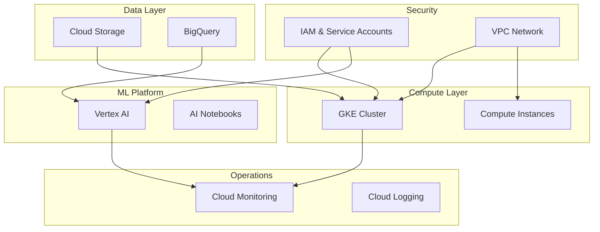
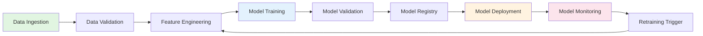
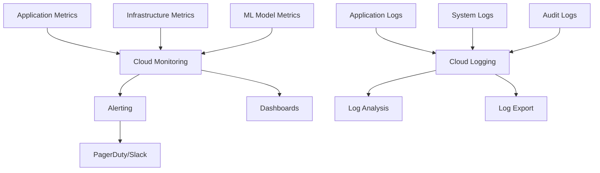

# MLOps Infrastructure with Terraform

This repository contains Infrastructure as Code (IaC) for setting up and managing Machine Learning Operations (MLOps) infrastructure on Google Cloud Platform using Terraform.

## 📋 Overview

This project provides a modular, scalable, and maintainable infrastructure foundation for MLOps workflows, including:
- Data pipeline infrastructure
- Model training environments
- Model serving and deployment
- Monitoring and logging
- Security and access management

## 🏗️ Architecture Overview



## 🔄 MLOps Workflow



## 📁 Project Structure

```
.
├── main.tf                 # Main Terraform configuration
├── provider.tf            # Provider configuration
├── variables.tf           # Variable definitions
├── outputs.tf            # Output definitions
├── modules/              # Reusable Terraform modules
│   ├── big-query/       # BigQuery infrastructure
│   │   ├── main.tf
│   │   ├── variables.tf
│   │   └── outputs.tf
│   ├── service-accounts/ # IAM and service accounts
│   │   ├── main.tf
│   │   ├── variables.tf
│   │   └── outputs.tf
│   └── ...              # Additional modules
└── environments/        # Environment-specific configurations
    ├── dev/
    ├── staging/
    └── prod/
```

## 🚀 Getting Started

### Prerequisites

- Terraform >= 1.0
- Google Cloud SDK (`gcloud`)
- GCP Project with billing enabled
- Appropriate IAM permissions

### Installation

1. Clone this repository:
```bash
git clone <repository-url>
cd mlops_terraform
```

2. Initialize Terraform:
```bash
terraform init
```

3. Create a `terraform.tfvars` file with your project-specific values:
```hcl
project_id = "your-gcp-project-id"
region     = "us-central1"
```

4. Plan and apply the infrastructure:
```bash
terraform plan
terraform apply
```

## 📦 Modules

### BigQuery Module
Manages data warehouse infrastructure for:
- Training and validation datasets
- Feature stores
- Model performance metrics
- Experiment tracking data

### Service Accounts Module
Handles IAM and security for:
- ML pipeline service accounts
- Compute resource access
- Cross-service authentication
- Least privilege access control

## 🔧 Configuration

The infrastructure can be customized through variables in `terraform.tfvars`:

```hcl
# Project Configuration
project_id = "your-project-id"
region     = "us-central1"
zone       = "us-central1-a"

# ML Infrastructure
ml_bucket_name = "ml-artifacts"
bigquery_dataset_name = "ml_data"

# Compute Resources
training_machine_type = "n1-standard-8"
serving_machine_type = "n1-standard-4"
```

## 🛡️ Security Considerations

- All resources follow the principle of least privilege
- Service accounts are created with minimal required permissions
- VPC networks isolate compute resources
- Encryption at rest is enabled for all storage resources
- Audit logging is configured for compliance

## 📊 Monitoring and Observability



## 🔄 CI/CD Integration

This infrastructure supports GitOps workflows:

1. **Infrastructure Changes**: PR → Review → Terraform Plan → Approval → Apply
2. **ML Pipeline Changes**: Code Push → Build → Test → Deploy → Monitor

## 📝 Best Practices

1. **State Management**: Terraform state is stored in GCS with versioning enabled
2. **Module Reusability**: Use modules for repeated patterns
3. **Environment Separation**: Separate configurations for dev/staging/prod
4. **Version Pinning**: Lock provider and module versions
5. **Documentation**: Keep README and inline comments updated

## 🤝 Contributing

1. Fork the repository
2. Create a feature branch (`git checkout -b feature/amazing-feature`)
3. Commit your changes (`git commit -m 'Add amazing feature'`)
4. Push to the branch (`git push origin feature/amazing-feature`)
5. Open a Pull Request

## 📄 License

This project is licensed under the MIT License - see the LICENSE file for details.

## 🔗 Related Resources

- [Terraform Documentation](https://www.terraform.io/docs)
- [Google Cloud Platform Documentation](https://cloud.google.com/docs)
- [MLOps Best Practices](https://cloud.google.com/architecture/mlops-continuous-delivery-and-automation-pipelines-in-machine-learning)
- [Infrastructure as Code Patterns](https://www.terraform.io/docs/language/modules/develop/index.html)
