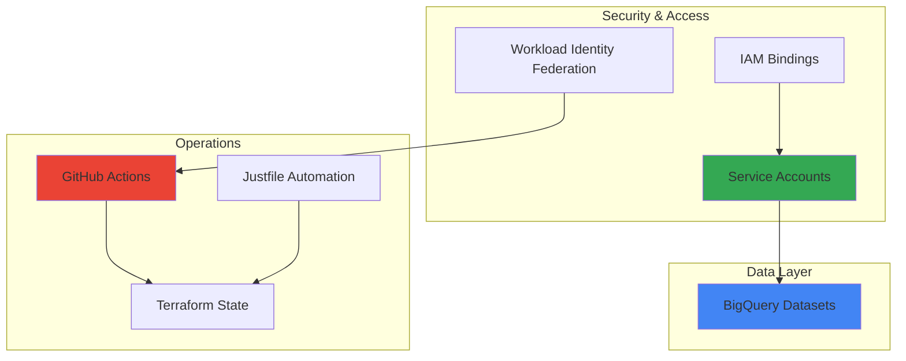
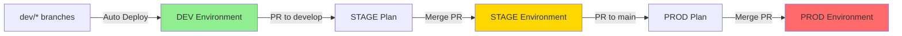

# MLOps Infrastructure with Terraform

This repository contains Infrastructure as Code (IaC) for setting up and managing Machine Learning Operations (MLOps) infrastructure on Google Cloud Platform using Terraform.

## 📋 Overview

This project provides a modular, scalable, and maintainable infrastructure foundation for MLOps workflows with:
- **BigQuery** infrastructure for data warehousing and ML datasets
- **Service Accounts** with proper IAM bindings for secure access
- **GitFlow-based CI/CD** with GitHub Actions automation
- **Per-environment state isolation** using dedicated GCS buckets
- **Workload Identity Federation** for keyless authentication

## 🏗️ Current Architecture



## 🔄 GitFlow Process



## 📁 Project Structure

```
.
├── justfile                # Task automation and environment management
├── modules/               # Reusable Terraform modules
│   ├── big-query/        # BigQuery datasets and access control
│   │   ├── main.tf
│   │   ├── variables.tf
│   │   ├── outputs.tf
│   │   └── README.md
│   └── service-accounts/ # Service accounts and IAM bindings
│       ├── main.tf
│       ├── variables.tf
│       └── outputs.tf
├── environments/         # Environment-specific configurations
│   ├── dev/             # Development environment
│   │   ├── main.tf      # Module instantiation
│   │   ├── variables.tf # Variable definitions
│   │   ├── outputs.tf   # Output values
│   │   ├── provider.tf  # GCP provider with impersonation
│   │   ├── backend.tf   # State backend configuration
│   │   └── terraform.tfvars
│   ├── stage/           # Staging environment (same structure)
│   └── prod/            # Production environment (same structure)
├── scripts/             # Automation scripts
│   ├── setup-wif.sh     # Workload Identity Federation setup
│   ├── verify-wif.sh    # WIF verification
│   └── bigquery-tests/  # BigQuery testing scripts
└── .github/workflows/   # GitHub Actions CI/CD
    └── terraform.yml    # Automated deployment workflow
```

## 🚀 Getting Started

### Prerequisites

- Terraform >= 1.0
- Google Cloud SDK (`gcloud`)
- Just command runner (`brew install just` or see [installation guide](https://github.com/casey/just))
- GCP billing account
- Owner or Editor permissions on GCP projects

### Quick Setup

1. **Clone and configure:**
```bash
git clone <repository-url>
cd mlops_terraform
```

2. **Set up environment variables:**
```bash
just setup-vars
```

3. **Create projects and enable billing (if needed):**
```bash
just create-projects --all
just enable-apis --all
```

4. **Create service accounts:**
```bash
just create-service-accounts --all
```

5. **Set up Terraform backends:**
```bash
just setup-backend --all
```

6. **Grant yourself impersonation permissions:**
```bash
just grant-impersonation dev user:your-email@example.com
```

7. **Initialize and deploy to an environment:**
```bash
just init dev
just plan dev
just apply dev
```

## 📦 Implemented Modules

### BigQuery Module
Creates and manages BigQuery infrastructure:
- **Datasets**: `ml_raw_data`, `ml_processed_data`, `ml_features`, `ml_models`
- **Access Control**: IAM-based permissions for users, groups, and service accounts
- **Lifecycle**: 90-day default table expiration with customizable retention
- **Features**:
  - Separate access levels (Owner, Editor, Viewer)
  - Group-based access for teams
  - Service account integration for ML pipelines
  - Deletion protection (configurable per environment)

### Service Accounts Module
Creates and configures service accounts:
- **ML Pipeline SA**: For automated ML workflows and data processing
- **IAM Roles**: 
  - BigQuery Data Editor (for ML pipeline)
  - Storage Object Viewer (for data access)
  - Logging Writer (for audit trails)
- **Integration**: Automatically linked with BigQuery datasets

## 🔧 Configuration

### Environment Variables
Each environment has its own `terraform.tfvars`:

```hcl
# Project Configuration
project_id     = "mycompany-mlops-dev"
project_number = "123456789012"
region         = "us-central1"
zone           = "us-central1-a"

# BigQuery Access Control
dataset_owners  = ["user:data-admin@company.com"]
dataset_writers = ["user:ml-engineer@company.com"]
dataset_readers = ["user:analyst@company.com"]

# Group Access (optional)
ml_team_group   = "ml-team@company.com"
analysts_group  = "data-analysts@company.com"
```

### Justfile Commands
Key automation commands:

```bash
# Environment setup
just setup-vars              # Configure project IDs and regions
just setup <env>           # Complete setup for all environments

# Individual operations
just init <env>             # Initialize Terraform
just plan <env>             # Show planned changes
just apply <env>            # Apply changes
just destroy <env>          # Destroy resources

# CI/CD setup
just setup-wif <env> <org> <repo>  # Configure GitHub Actions auth
just grant-impersonation <env> <member>  # Grant access to team members
```

## 🛡️ Security Features

### Authentication & Authorization
- **Workload Identity Federation**: Keyless authentication for CI/CD
- **Service Account Impersonation**: No key files needed
- **Separate Service Accounts**:
  - `terraform-<env>@`: State management only
  - `terraform-<env>-resources@`: Infrastructure provisioning
- **Principle of Least Privilege**: Minimal required permissions

### State Management
- **Isolated State Files**: Separate GCS bucket per environment
- **Encryption**: State files encrypted at rest
- **Versioning**: Automatic state file versioning
- **Access Logging**: All state access is audited

## 🔄 CI/CD with GitHub Actions

### Automated Deployment Flow
1. **Development**: Push to `dev/*` → Auto-deploy to DEV
2. **Staging**: PR to `develop` → Plan comment → Merge → Auto-deploy to STAGE
3. **Production**: PR to `main` → Plan comment → Review → Merge → Auto-deploy to PROD

### Key Features
- **Plan Visibility**: PRs show exact changes before merge
- **Two-Person Rule**: Production requires separate creator and approver
- **Drift Detection**: Daily scheduled runs on production
- **Environment Isolation**: Complete separation between environments

## 📝 Best Practices

### Development Workflow (See [GITFLOW_PROCESS.md](./GITFLOW_PROCESS.md))
1. **Feature Branches**: Always use `dev/*` prefix for feature branches
2. **Test in DEV**: Validate changes in development before promoting
3. **PR Reviews**: All changes to stage/prod require PR approval
4. **Plan Review**: Always review Terraform plan output before approving

### Infrastructure Management
1. **State Isolation**: Never share state files between environments
2. **Use Impersonation**: Avoid downloading service account keys
3. **Module Updates**: Test module changes in dev first
4. **Rollback Strategy**: Keep previous terraform plans for quick rollback

### Security
1. **No Secrets in Code**: Use GitHub Secrets for sensitive data
2. **Audit Access**: Regularly review service account permissions
3. **Enable Logging**: All service accounts have logging enabled
4. **Principle of Least Privilege**: Grant minimal required permissions

## 🚧 Roadmap

Planned additions to the infrastructure:

- [ ] Cloud Storage buckets for ML artifacts
- [ ] Vertex AI integration for model training
- [ ] Cloud Composer for workflow orchestration
- [ ] Monitoring and alerting setup
- [ ] VPC network configuration
- [ ] Cloud Run for model serving

## 📖 Documentation

- [GitFlow Process](./GITFLOW_PROCESS.md) - Detailed branching and deployment strategy
- [GitHub Actions Setup](./GITHUB_ACTIONS_SETUP.md) - CI/CD configuration guide
- [Production Setup Workflow](./PRODUCTION_SETUP_WORKFLOW.md) - Step-by-step production setup
- [Justfile Usage](./JUSTFILE_USAGE.md) - Complete command reference

## 🤝 Contributing

1. Create a feature branch (`git checkout -b dev/your-feature`)
2. Make your changes and test locally
3. Commit with clear messages
4. Push and create PR to `develop`
5. Ensure all checks pass
6. Get review and approval

## 🔗 Resources

- [Terraform GCP Provider](https://registry.terraform.io/providers/hashicorp/google/latest/docs)
- [GCP IAM Best Practices](https://cloud.google.com/iam/docs/best-practices)
- [Workload Identity Federation](https://cloud.google.com/iam/docs/workload-identity-federation)
- [Just Command Runner](https://github.com/casey/just)
